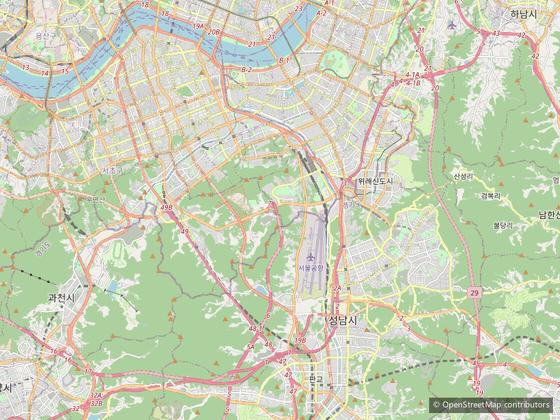
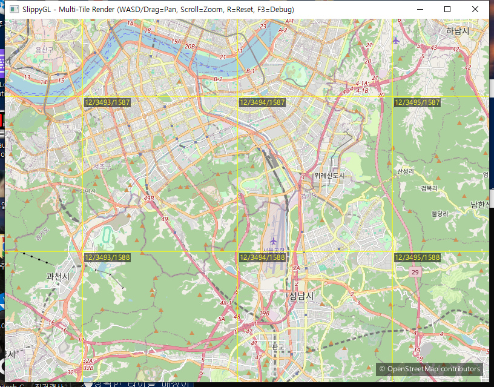

# SlippyGL

[](https://github.com/Park52/SlippyGL/actions/workflows/ci.yml)

OpenGL 기반 **slippy map 뷰어**. [OpenStreetMap](https://www.openstreetmap.org/) 래스터 타일(PNG)을
view-driven 방식으로 내려받아 실시간 렌더링하는 C++17 프로젝트입니다.
학습·포트폴리오 목적이며, 기능을 점진적으로 확장하기 쉬운 모듈 구조를 지향합니다.



> WASD 패닝 · 스크롤 줌 · F3 디버그 오버레이. 우하단에 `© OpenStreetMap contributors` 상시 표시.
> ([정지 스크린샷](docs/images/screenshot.png))

---

## ✨ 기능

- **타일 로딩** — 뷰포트 기준으로 보이는 타일만 OSM에서 요청 (Web Mercator `z/x/y`)
- **줌별 동적 로딩/언로딩** — 줌 레벨 변경 시 카메라 좌표계를 재매핑해 항상 보이는 타일만 표시,
  화면을 벗어나면 LRU로 해제
- **카메라 제어** — WASD/방향키 패닝(부드러운 가·감속) + 마우스 드래그 패닝 + 스크롤 줌(커서 중심)
- **디버그 오버레이** — `F3`로 타일 경계선 + 타일 ID(`z/x/y`) 토글
- **저작자 표시** — 우하단에 `© OpenStreetMap contributors` 상시 노출 (TTF 글리프 렌더)
- **인메모리 LRU 캐시** — 받은 타일 텍스처를 세션 동안 GPU에 재사용, 디스크 영구 저장 없음

### 디버그 오버레이 (F3)



> 노란 타일 경계선과 `z/x/y` 라벨로 타일 격자를 시각화.

---

## 🎮 조작

| 입력 | 동작 |
|---|---|
| `W` `A` `S` `D` / 방향키 | 패닝 (부드러운 가속/감속) |
| 마우스 드래그 | 패닝 |
| 마우스 스크롤 | 줌 인/아웃 (커서 중심) |
| `R` | 카메라 리셋 |
| `F3` | 디버그 오버레이 토글 |
| `ESC` | 종료 |

---

## 🗺️ OSM 타일 정책 준수

이 프로젝트는 [OSM 공식 타일 사용 정책](https://operations.osmfoundation.org/policies/tiles/)을 따릅니다.

- ✅ **고유 User-Agent** 전송: `SlippyGL/0.1 (+https://github.com/Park52/SlippyGL)`
- ✅ **인메모리 캐시만** 사용 — 타일을 디스크/DB에 영구 저장하지 않음 (세션 종료 시 소멸)
- ✅ **prefetch 안 함** — 현재 화면에 보이는 타일만 요청
- ✅ **저작자 표시** 상시 노출
- ✅ **타일 URL 설정 가능** (하드코딩 금지) — 기본값 `https://tile.openstreetmap.org/{z}/{x}/{y}.png`

---

## 🏗️ 아키텍처

기능 확장을 쉽게 하기 위해 책임을 모듈로 분리했습니다.

```
Application  ─ 앱 진입점, 메인 루프, 모듈 조립
    │
    ├─ Camera2D / InputHandler ─ WASD·드래그·스크롤 입력 → 카메라 상태
    ├─ TileGrid               ─ 카메라/뷰포트 → 보이는 z/x/y 타일 목록 산출
    ├─ TileRenderer           ─ 가시 타일 렌더 + 디버그 오버레이
    │     ├─ TileCache        ─ 인메모리 LRU (key=z/x/y, value=GL 텍스처)
    │     └─ TileDownloader   ─ 네트워크 전용 (HTTP GET, User-Agent)
    │           ├─ HttpClient ─ libcurl 래퍼
    │           └─ PngCodec   ─ PNG → RGBA (stb_image)
    ├─ QuadRenderer           ─ 텍스처 쿼드 렌더 (OpenGL)
    └─ TextRenderer           ─ 저작자 표시 / 디버그 텍스트 (stb_truetype)
```

> 의존 방향은 상위 → 하위 단방향. 하위 모듈은 상위를 모릅니다.

### 좌표계 노트
"월드 픽셀" = `타일 인덱스 × 256`이며 줌 레벨마다 스케일이 달라집니다. 줌 레벨이 바뀌면
`Camera2D::applyZoomStep()`이 `worldOrigin`/`scale`을 재매핑해 화면 뷰를 보존하면서
좌표계를 새 줌 레벨에 맞춥니다.

---

## 🧰 기술 스택

- **언어:** C++17
- **그래픽스:** OpenGL 3.3 Core Profile
- **윈도우/입력:** GLFW
- **GL 로더:** GLAD
- **HTTP:** libcurl
- **이미지 디코드:** stb_image (PNG)
- **텍스트:** stb_truetype (TTF 글리프 아틀라스)
- **로깅:** spdlog
- **수학:** glm (submodule)
- **빌드:** CMake 3.21+ / vcpkg(매니페스트 모드)

---

## ⚙️ 빌드 & 실행

### 1) Submodule 초기화 (필수)
```bash
git submodule update --init --recursive   # external/glm, external/stb
```

### 2) CMake + vcpkg (권장)
```bash
cmake -S SlippyGL -B SlippyGL/build -G "Visual Studio 17 2022" -A x64 \
  -DCMAKE_TOOLCHAIN_FILE=<VCPKG_ROOT>/scripts/buildsystems/vcpkg.cmake
cmake --build SlippyGL/build --config Release
```
> 의존성(glfw3·glad·curl·spdlog)은 최초 configure 시 vcpkg 매니페스트(`SlippyGL/vcpkg.json`)로
> 자동 설치됩니다. 실행 파일: `SlippyGL/build/Release/SlippyGL.exe`

### 3) Visual Studio 2022
`SlippyGL/SlippyGL.sln`을 열고 vcpkg 매니페스트 모드(`x64-windows`)로 빌드합니다.

---

## 📂 프로젝트 구조

```
SlippyGL/
├── CMakeLists.txt
├── vcpkg.json
├── src/
│   ├── app/      # 진입점, 메인 루프 (SlippyGL.cpp)
│   ├── core/     # 좌표 변환(TileMath), 공통 타입
│   ├── net/      # libcurl HTTP 클라이언트, 타일 엔드포인트
│   ├── decode/   # PNG 디코드 (stb_image)
│   ├── render/   # GL 부트스트랩, 쿼드/텍스트 렌더, 카메라, 입력
│   ├── tile/     # 타일 캐시(LRU), 다운로더, 격자, 렌더러
│   └── external/ # stb 구현 TU
└── external/     # glm, stb (git submodule)
```

---

## ⚠️ 한계 / 로드맵

- **검증 환경:** 현재 Windows(VS2022 + vcpkg)에서 빌드·실행 검증됨. macOS/Linux 빌드 경로는
  준비돼 있으나(폰트 자동 탐색 포함) 별도 검증 필요.
- **비목표(현재):** 디스크/오프라인 캐시, 영역 다운로드(정책상 제외), 벡터 타일·라벨·마커.
- **향후:** 타일 다운로드 비동기/병렬화(libcurl multi), 멀티 타일 소스, 벡터 타일(MVT).

---

## 📜 라이선스

- **코드:** [MIT License](LICENSE)
- **지도 데이터/타일:** © [OpenStreetMap contributors](https://www.openstreetmap.org/copyright) (ODbL)
